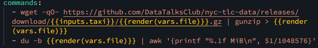
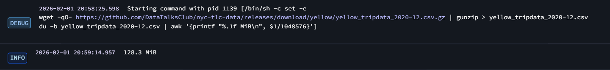

### **Muhammad Faris Akbar**
---

#### Question 1. Within the execution for Yellow Taxi data for the year 2020 and month 12: what is the uncompressed file size (i.e. the output file yellow_tripdata_2020-12.csv of the extract task)? (1 point)
- Answer : 128.3 MiB
- Solution :
1. Add a new command to the kestra command section by entering the following command:
```bash
- du -b {{render(vars.file)}} | awk '{printf "%.1f MiB\n", $1/1048576}'
```



2. Run the kestra flow, and check the file size in the execution logs section.


<br>

#### Question 2. What is the rendered value of the variable file when the inputs taxi is set to green, year is set to 2020, and month is set to 04 during execution? (1 point)
- Answer : green_tripdata_2020-04.csv
- Solution: 

1. To check the rendered value of a variable, you can check the labels in the execution section of the flow. Examples of rendered values for the file and taxi variables:


#### Question 3. How many rows are there for the Yellow Taxi data for all CSV files in the year 2020? (1 point)
- Answer : 24,648,499
- Solution :
1. Due to the fact that in the CSV data for yellow taxis in 2020, there are 280 data points with years outside of 2020. Using time extraction alone is not sufficient to obtain valid results, so string matching is required to obtain the desired results. The following is the SQL query used:

```SQL
SELECT 
COUNT(1) AS "Jumlah Data"
FROM public.yellow_tripdata
WHERE filename LIKE '%2020%';
```

#### Question 4. How many rows are there for the Green Taxi data for all CSV files in the year 2020? (1 point)
1. As before, in the 2020 green taxi data, there were 53 data points with years other than 2020, so string matching was required to obtain the desired results.
- Answer : 1,734,051
- Solution :

```SQL
SELECT 
COUNT(1) AS "Jumlah Data"
FROM public.green_tripdata
WHERE filename LIKE '%2020%';
```

#### Question 5. How many rows are there for the Yellow Taxi data for the March 2021 CSV file? (1 point)
- Answer : 1,925,152
- Solution :
```SQL
SELECT 
filename,
COUNT(1) AS "Jumlah Data"
FROM public.yellow_tripdata
WHERE 
filename LIKE '%2021-03%'
GROUP BY filename;
```

#### Question 6. How would you configure the timezone to New York in a Schedule trigger? (1 point)
- Answer : Add a timezone property set to America/New_York in the Schedule trigger configuration
- Solution : https://kestra.io/docs/workflow-components/triggers/schedule-trigger

```bash
triggers:
  - id: ...
    type: ...
    cron: ...
    timezone: America/New_York
```

#### Learning in Public
- https://www.linkedin.com/posts/m-faris-akbar-_github-datatalksclubdata-engineering-zoomcamp-activity-7418364049043685376-YPp-?utm_source=share&utm_medium=member_desktop&rcm=ACoAAC2WdgQBFNQvyaHEVM4pwzRNofINDz0G8dY
